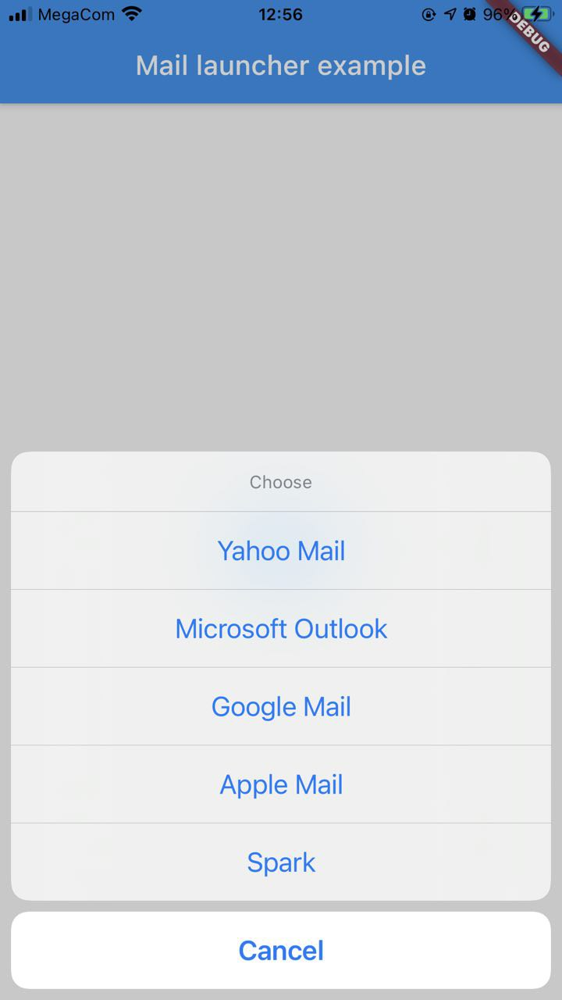
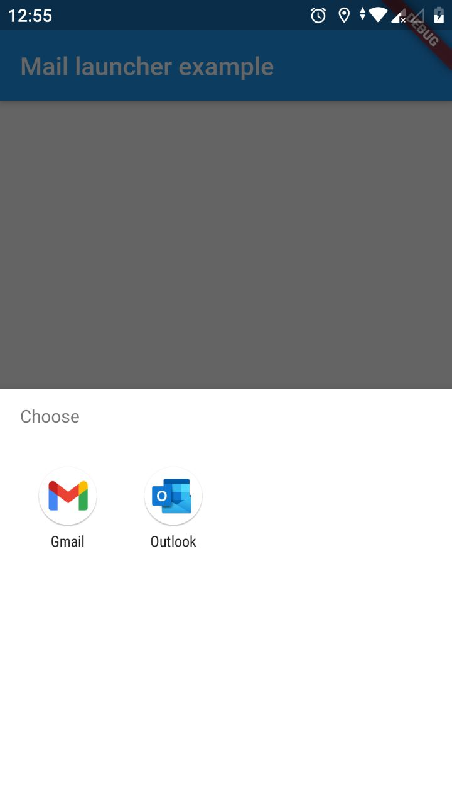

# mail_launcher

Open mail client select dialog to open `mailto:`. On ios it will show only specified apps if installed, on Android all apps which receives `mailto:` scheme. 

## Setup

### iOS

iOS requires you to list the URL schemes you would like to query in the `Info.plist` file.

```
<key>LSApplicationQueriesSchemes</key>
<array>
    <string>googlegmail</string>
    <string>x-dispatch</string>
    <string>readdle-spark</string>
    <string>airmail</string>
    <string>ms-outlook</string>
    <string>ymail</string>
    <string>fastmail</string>
</array>
```

## Usage

```
MailLauncher.launch(
    to: "to@example.com", 
    subject: "Subject", 
    body: "Body", 
    dialogTitle: "Choose",
);
```

## Screenshot



